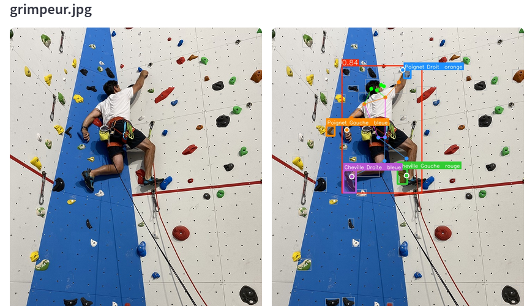
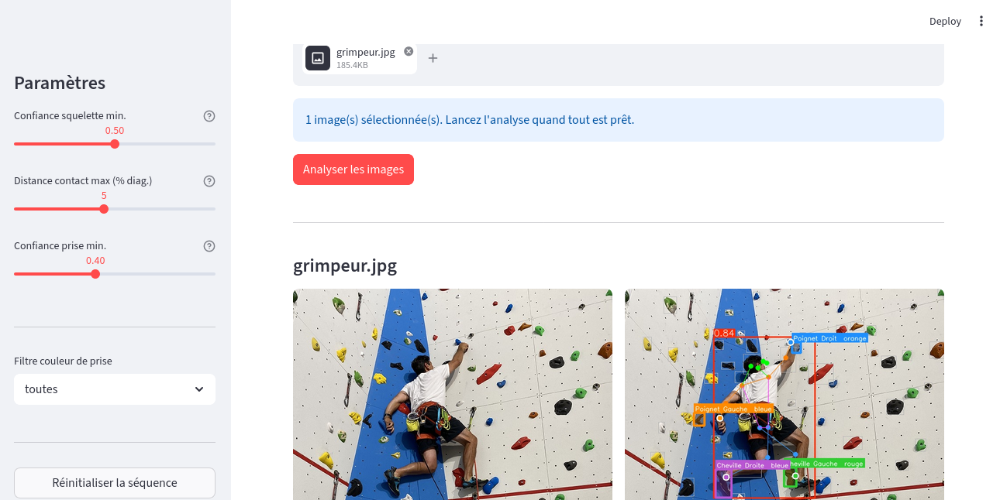
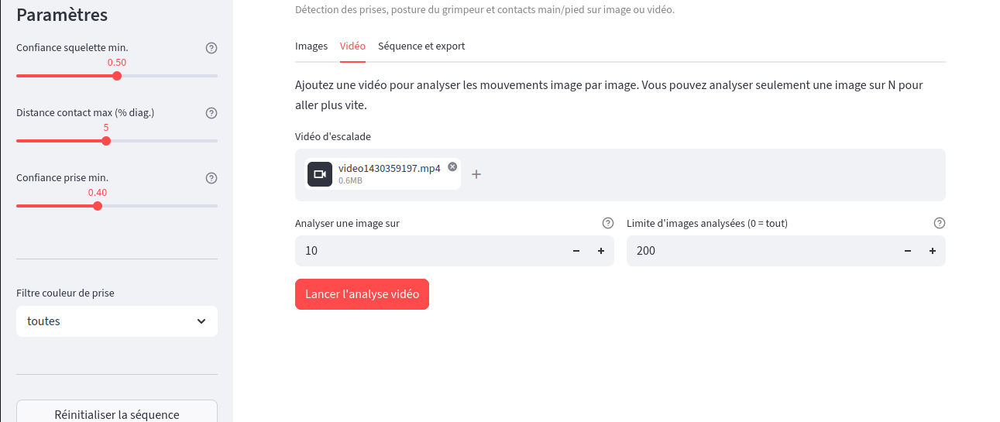

# Beta-Tracker - Analyse d'escalade

Beta-Tracker aide à analyser une image ou une vidéo d'escalade. Il détecte les prises, repère la posture du grimpeur, puis cherche les contacts entre les mains/pieds et les prises.

L'objectif est de reconstruire une première version du **béta**, c'est-à-dire la suite des mouvements utilisés sur un bloc.

## Démonstration

Voici un aperçu du résultat de l'analyse sur une image (à gauche l'image originale, à droite l'image avec le squelette et les prises en contact surlignées) :

## Comment ça marche

Le projet combine deux modèles YOLO :
- **Détection de prises** (`holds_model.pt`) : modèle entraîné sur le dataset Climbing Hold Detection (Roboflow)
- **Estimation de posture** (`yolov8n-pose.pt`) : modèle YOLOv8n-pose d'Ultralytics

Pour chaque image, le code compare la position des poignets et des chevilles avec les prises détectées. Si un membre est assez proche d'une prise, le projet l'ajoute comme contact possible. La couleur de la prise est estimée à partir de l'image.

## Installation

git clone <url-du-repo>
cd beta_tracker
python -m venv venv
source venv/bin/activate   # Windows : venv\Scripts\activate
pip install -r requirements.txt

Les modèles (`models/holds_model.pt` et `models/yolov8n-pose.pt`) sont inclus dans le dépôt.

## Utilisation

### Interface Streamlit (recommandée)

streamlit run app.py

L'interface propose trois onglets interactifs pour faciliter l'analyse. Voici à quoi ressemblent les onglets pour le traitement des images et des vidéos :

**Aperçu de l'onglet "Images" :**

**Aperçu de l'onglet "Vidéo" :**

| Onglet | Description |
|---|---|
| **Images** | Ajout d'une ou plusieurs images dans l'ordre, puis analyse de la séquence |
| **Vidéo** | Ajout d'une vidéo, traitement image par image et téléchargement de la vidéo annotée |
| **Séquence et export** | Liste des mouvements détectés, statistiques simples, export JSON/CSV |

**Paramètres disponibles dans la barre latérale :**
- Seuil de confiance du squelette (filtre les keypoints flous ou cachés)
- Distance de contact maximale (% de la diagonale de l'image)
- Seuil de confiance des prises
- Filtre par couleur de prise

### Traitement vidéo en ligne de commande

python process_video.py --input assets/climb.mp4 --output resultat.mp4 --skip 5

Options :

--input        Chemin de la vidéo source (défaut : assets/climb.mp4)
--output       Chemin de la vidéo annotée (défaut : assets/resultat_beta_tracker.mp4)
--skip N       Analyser 1 image vidéo sur N pour accélérer (défaut : 1)
--seuil-pose   Confiance posture minimale (défaut : 0.5)
--seuil-prise  Confiance prise minimale (défaut : 0.4)
--dist-frac    Distance contact max en fraction de diagonale (défaut : 0.05)
--max-frames   Limite de frames analysées, utile pour tester (défaut : 0 = tout)
--sequence-json Export optionnel des contacts bruts et mouvements dédupliqués

## Structure du projet

beta_tracker/
├── app.py                      # Interface Streamlit
├── beta_tracker_core.py        # Logique métier (détection contacts, couleurs)
├── process_video.py            # CLI de traitement vidéo
├── requirements.txt
├── models/
│   ├── holds_model.pt          # Modèle de détection de prises (custom)
│   └── yolov8n-pose.pt         # Modèle de posture YOLOv8n
├── assets/
│   ├── climb.mp4               # Vidéo de démonstration
│   └── grimpeur.png            # Image de test
└── scripts/
    ├── evaluate.py             # Évaluation du modèle sur le dataset test
    ├── train.py                # Entraînement (nécessite wandb + dataset)
    ├── download.py             # Téléchargement dataset depuis Roboflow
    ├── test_pose.py            # Test rapide modèle de pose
    ├── test_vision.py          # Test rapide modèle de prises
    └── tracker_logique.py      # Test rapide du pipeline complet image

## Scripts utilitaires

### Test concret du pipeline complet

python scripts/tracker_logique.py
python process_video.py --input assets/climb.mp4 --output assets/resultat_beta_tracker.mp4 --skip 10 --max-frames 50 --sequence-json runs/demo_sequence.json

Le premier test vérifie rapidement la chaîne image : modèle de prises, modèle de pose, puis contacts.  
Le second test vérifie la chaîne vidéo et produit un JSON avec :
- `contacts_bruts` : tous les contacts détectés image par image
- `mouvements` : version dédupliquée, plus proche du béta réel

### Évaluation du modèle

python scripts/evaluate.py --split test
python scripts/evaluate.py --split val --save-json

Cette évaluation mesure surtout la qualité du modèle de détection de prises (mAP, précision, rappel) sur le dataset annoté. Elle ne mesure pas toute seule la qualité du béta reconstruit. Pour ça, il faut comparer le JSON généré avec quelques vidéos annotées à la main.

Résultats obtenus avec `scripts/evaluate.py` sur le dataset Roboflow :

| Split | Sortie | Précision | Rappel | mAP@50 | mAP@50-95 |
|---|---|---:|---:|---:|---:|
| test | Boîtes | 0.8780 | 0.7072 | 0.8005 | 0.6125 |
| test | Masques | 0.8449 | 0.6696 | 0.7460 | 0.4357 |
| val | Boîtes | 0.8605 | 0.7641 | 0.8498 | 0.6602 |
| val | Masques | 0.8259 | 0.7280 | 0.8047 | 0.4996 |

### Limites de l'évaluation

L'évaluation automatique couvre la détection des prises et vérifie que le pipeline image/vidéo fonctionne. Elle ne valide pas encore précisément toute la séquence de mouvements, car il faudrait un petit jeu de vidéos avec contacts annotés à la main : membre, prise, image de début et image de fin.

Le résultat doit donc être vu comme une aide à l'analyse, pas comme une vérité absolue.

### Téléchargement du dataset

export ROBOFLOW_API_KEY=votre_cle
python scripts/download.py

### Ré-entraînement

python scripts/train.py

## Dépendances principales

| Librairie | Usage |
|---|---|
| `ultralytics` | Modèles YOLO (détection + pose) |
| `streamlit` | Interface web |
| `opencv-python-headless` | Traitement vidéo/image |
| `Pillow` | Manipulation d'images |
| `numpy` / `pandas` | Calculs et tableaux de données |

## Membres détectés

| Membre | Couleur |
|---|---|
| Poignet Gauche | Orange |
| Poignet Droit | Bleu |
| Cheville Gauche | Vert |
| Cheville Droite | Violet |